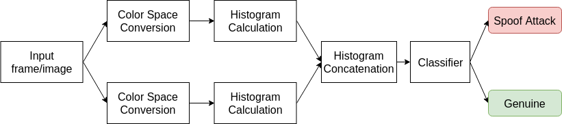

# [Presentation Attack Detection](https://github.com/ee09115/spoofing_detection)

## Overview
This repository is dedicated to the image-based Presentation Attack Detection - PAD -  systems in two different domains: (i) cork and (ii) face PAD. The proposed PAD system relies on the combination of two different color spaces and uses only a single frame to distinguish from a bona fide image and an image attack, see Fig. 1. 

Fig. 1 - General flowchart for the developed image-based PAD system.

## Contents
* Trained models for the public face anti-spoofing [Print-attack](https://www.idiap.ch/dataset/printattack) database;
* Trained models for the public face anti-spoofing [Replay-attack](https://www.idiap.ch/dataset/replayattack) database;
* Error rate curve for the development set of the [Print-attack](https://www.idiap.ch/dataset/printattack) database
* Error rate curve for the development set of the [Replay-Attack](https://www.idiap.ch/dataset/replayattack) database;
* [1] - [Image-based Object Spoofing Detection](https://link.springer.com/chapter/10.1007%2F978-3-030-05288-1_15) - Conference paper

## Results
<table>
  <tr>
    <td rowspan="2">Method</td><td colspan="2">Print-attack</td><td colspan="2">Replay-attack</td>
  </tr>
  <tr>
    <td>EER(%)</td><td>HTER(%)</td><td>EER(%)</td><td>HTER(%)</td>
  </tr>
  <tr> 
    <td>YCRCB+LUV+ETC [1]</td> <td>1.33</td> <td>0.00</td> <td>0.00756</td> <td>0.5954</td>
  </tr>
  <tr>
    <td>YCRCB+LUV+SVM [1]</td> <td>0.00</td> <td>1.76</td> <td>4.30</td> <td>7.86</td>
  </tr>
</table>

### Cork Spoofing Detection

### Face Spoofing Detection

Demonstrative results of the proposed face PAD system - YCRCB+LUV+ETC. The classification model used in this test was trained using the training set of the Replay-Attack database.

## How to cite
If you use any part of this work please cite [1]:

    @InProceedings{10.1007/978-3-030-05288-1_15,
    author="Costa, Valter
    and Sousa, Armando
    and Reis, Ana",
    editor="Barneva, Reneta P.
    and Brimkov, Valentin E.
    and Tavares, Jo{\~a}o Manuel R.S.",
    title="Image-Based Object Spoofing Detection",
    booktitle="Combinatorial Image Analysis",
    year="2018",
    publisher="Springer International Publishing",
    address="Cham",
    pages="189--201",
    abstract="Using 2D images in authentication systems raises the question of spoof attacks: is it possible to deceive an authentication system using fake models possessing identical visual properties of the genuine one? In this work, an anti-spoofing method approach for a wine anti-counterfeiting system is presented. The proposed method relies in two different color spaces: CIE L*u*v* and {\$}{\$}YC{\_}rC{\_}b{\$}{\$}, to distinguish between a genuine instance and a spoof attack. To evaluate the proposed strategy, two databases were used: a private database, with photos/2D attacks of cork stoppers, created for this work; and the public Replay-Attack database that is used for face spoofing detection methods testing. The results on the private database show that the anti-spoofing approach is able to distinguish with high accuracy a real photo from an attack. Regarding the public database, the results were obtained with existing methods, as the best HTER results using a single frame approach.",
    isbn="978-3-030-05288-1"
    }

